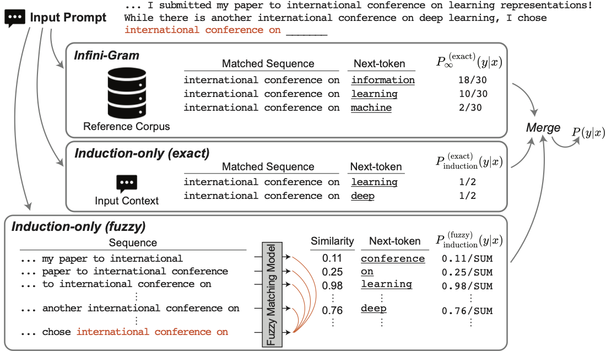

<h1 align="center"> 🔍 Induction-Gram 🔍 </h1>
<p align="center"> <b>Interpretable Language Modeling via Induction-head Ngram Models</b>  (<a href="https://arxiv.org/abs/2411.00066">Kim*, Mantena* et al. 2024</a>). 
</p>

<p align="center">
  
  
</p>  



# Interpretable Language Modeling via Induction-head Ngram Models

> Recent large language models (LLMs) have excelled across a wide range of tasks, but their use in high-stakes and compute-limited settings has intensified the demand for interpretability and efficiency. We address this need by proposing Induction-head ngram models (Induction-Gram), a method that builds an efficient, interpretable LM by bolstering modern ngram models with a hand-engineered "induction head". This induction head uses a custom neural similarity metric to efficiently search the model's input context for potential next-word completions. This process enables Induction-Gram to provide ngram-level grounding for each generated token. Moreover, experiments show that this simple method significantly improves next-word prediction over baseline interpretable models (up to 26%p) and can be used to speed up LLM inference for large models through speculative decoding. We further study Induction-Gram in a natural-language neuroscience setting, where the goal is to predict the next fMRI response in a sequence. It again provides a significant improvement over interpretable models (20% relative increase in the correlation of predicted fMRI responses), potentially enabling deeper scientific investigation of language selectivity in the brain.


### Setup
- Clone the repo and run `pip install -e .` to install the `alm` package locally
- Set paths/env variables in `alm/config.py` to point to the correct directories to store data
- Experiments
  - For language modeling experiments, please refer to `experiments/readme.md`.


### Organization
- `alm` is the main package
  - `alm/config.py` is the configuration file that points to where things should be stored
  - `alm/data` contains data utilities
  - `alm/models` contains source for models
- `data` contains code for preprocessing data
- `experiments` contains code for language modeling experiments

### Citation
If you find this work useful, please cite:
```r
@misc{kim2024inductiongram,
      title={Interpretable Language Modeling via Induction-head Ngram Models}, 
      author={Eunji Kim and Sriya Mantena and Weiwei Yang and Chandan Singh and Sungroh Yoon and Jianfeng Gao},
      year={2024},
      eprint={2411.00066},
      archivePrefix={arXiv},
      primaryClass={cs.CL},
      url={https://arxiv.org/abs/2411.00066}, 
}
```